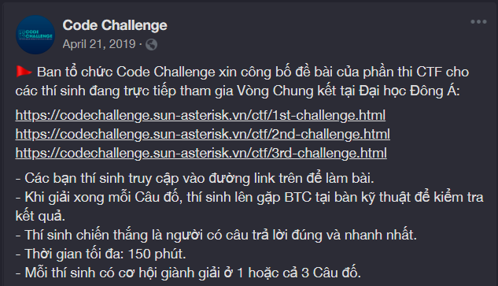

# Code Challenge 2019 - Round 2 - CTF3
> `original/codechallenge2019_CTF3.b`

## Event summary

The Code Challenge 2019 Central event consisted of 2 round, up to 100 competitors. The first round is IOI format, a contestant has to solve 5 competitive programming tasks, with increasing difficulties. Each task has subtasks, if a subtask is fully solved, contestant gain points assigned for that subtask, if not, they won't gain a single point. If two contestants have equal points, time penalty (im not so sure now, its has been a year) is taken to consideration.

After that, 100 competitors will then be splitted into 2 group, top 10 of Round 1 will go to Round 2 - CP, while the others 90 go to Round 2 - CTF. I secured myself a spot in the top 10, so I couldn't participate in the CTF round.

I did poorly on Round 2 though. (no one asked i know)

## Round 2 - CTF: The problems
By the time I wrote this, the three links have died :(

I couldn't remember what the first problem was.
But the second problem was sort of a sudoku/magic matrix/... math game, nothing special (to me).
The third one however, was a HTML page with the organizer logo and some of the `brainfuck` operators on it. Turns out, the whole page is filled with `brainfuck`, by Select All, we have ourself a brainfuck program.

### CTF3
Luckily, when I got home that day, I sat down and tried the problem itself. So i still have the source on my hand.

Check `original/codechallenge2019_CTF3.b`.

## Attempts:
### (2019/??/??) Attempt#1:
When you run the program, it prints `Enter key:` and awaits for input.
I noticed there were 3 `,` operators, this means it takes a `byte` from standard input stream.

Quickly, I assumed the problem was simply enter the right 3-character-long password, which can be quickly brute-force'd through.

This is where I got stuck though. I had no idea how to execute this `brainfuck` thing. Maybe I'm supposed to write my own compiler or something.

After invested lots of time in looking for _something_.. I decided to use a `brainfuck to c` converter. Compiled that `C` code but it ran so fucking slow! Maybe it needed some sort of compile flag?? I had no fucking clue at that time.

Anyway that was all I could remember on my first attempt to solve it.

### (2020/07/02) Attempt#2:
I did a search again and grabbed another brainfuck-to-C program, this time for some reasons the `C` program ran rather quick. lol. i refused to believe that i forked an unusable transalator @attempt#1.

Well anyway, I then wrote a brute-force python script to go through all combination of length of 3 of `printable character` and feed it to the `C` program and retrieve the results. It was depressingly slowww... After ~1 hour it achieved only about 30%. I aborted it, i know i should have let it finish but this is the wrong approach, i couldn't sit with that.

### (2020/07/14) Attempt#3: SOLVED
This time, I suddenly remembered a certain magical girl named [Nayuki](nayuki.io).

I could refer to her ultimately [OPTIMIZED BRAINFUCK COMPILER](https://www.nayuki.io/page/optimizing-brainfuck-compiler). Maybe not as dramatic, but i discovered her when I was a highschool kid and I revered her (as a magical girl, not as an actual human being). I, with high confidence, believe her weapon shall help me. (that was chuuni as fuck)

Anyway i solved it. The real answer is not brute-force... because the flag was contained in an sort-of `if-else` branch, instead of trying to make the program to stear to the correct branch, why don't we just force it to go to that branch (like: `if (true)`).

lol i am so disapointed with myself because i was sloppy, lazy. I should have read the source code, do just a little bit of brainwork, add some code to debug it,.. rather than just jump to brute-force this brute-force that.

I am rotten. I am a living example of why future generations are getting lazier and more stupid. I am ashamed.

The moment I solved it, just a beam of joy then after that is an endless spiral of disgust and distrust toward my inability to recognize such solution.

I pity myself, and pity everyone who has come across me. Sorry for my existence.

### Solution:
The flag was `Code{brAnf*ck}`. Check folder `\attempt3`, `ctf.c` is the code generated by `Nayuki`'s transaltor, Line 319 was the line that I added to force jump to wanted branch.